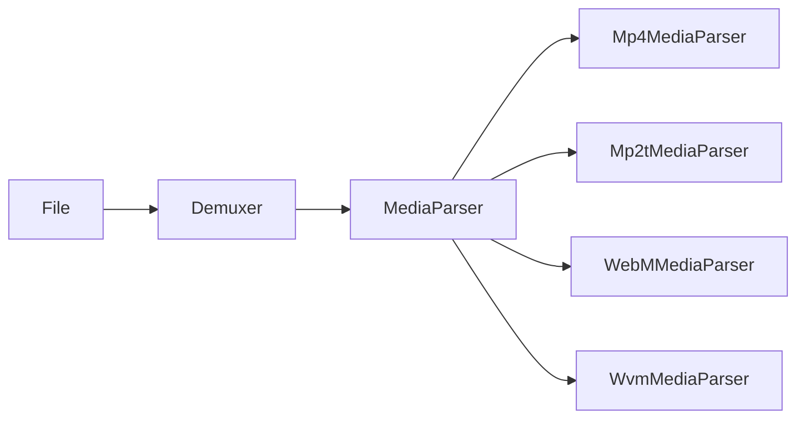
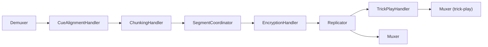
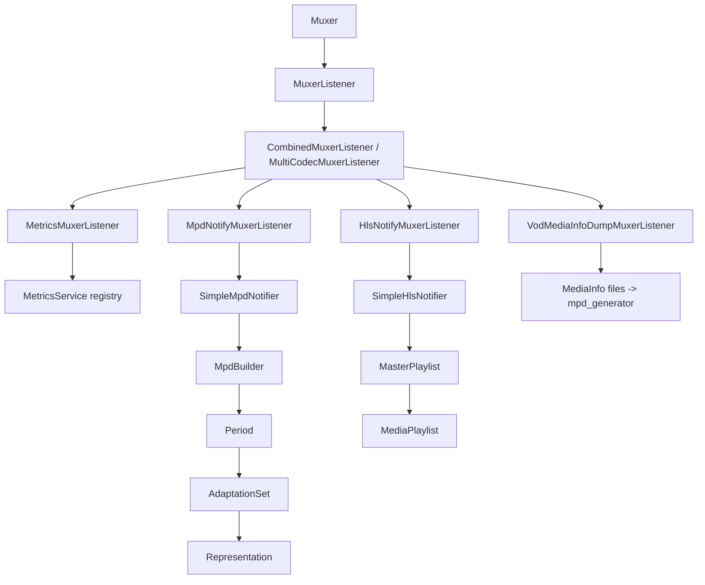

# Shaka Packager — High-Level Architecture

This document is a map of the codebase: the major layers, the one abstraction
everything is built on, and how a run is wired together. It is deliberately
high level — for details, the `CMakeLists.txt` files are the authoritative
source of module structure, and [docs/source/design.rst](docs/source/design.rst)
holds the original upstream diagrams (rendered via Sphinx/graphviz).

This tree is a fork of upstream `shaka-project/shaka-packager` (based on
v3.9.3) with additional features; see [Fork-specific extensions](#12-fork-specific-extensions).

---

## 1. What it is

A C++17 media packaging engine that reads media (files, HTTP, live UDP
MPEG-TS), transforms it (repackage, chunk into segments, encrypt for DRM,
generate trick-play tracks), writes it out (fMP4/CMAF, TS, WebM, packed audio,
WebVTT/TTML), and emits DASH MPD and HLS playlists describing the result.

Four artifacts are built on the same core:

| Artifact | Source | Role |
| --- | --- | --- |
| `packager` | [packager/app/packager_main.cc](packager/app/packager_main.cc) | CLI. Parses absl flags + stream descriptors into `PackagingParams`, calls the library. |
| `mpd_generator` | [packager/app/mpd_generator.cc](packager/app/mpd_generator.cc) | Standalone tool: builds an MPD from previously dumped `MediaInfo` files. |
| `libpackager` | [packager/packager.cc](packager/packager.cc) + [include/packager/](include/packager/) | The SDK. Public API is `shaka::Packager` (`Initialize` / `Run` / `Cancel`). |
| `packager-api` | [packager/webapi/](packager/webapi/) | Fork addition — an HTTP/REST control plane that spawns and supervises `packager` processes as "events". See §14. |

The CLI is a thin shell — all orchestration lives in `libpackager`, which is why
the SDK and the tool cannot diverge in behaviour. `packager-api` is the one
exception to that rule: it does *not* link `libpackager`, it drives the CLI as a
subprocess, so process isolation per channel comes for free.

---

## 2. Layer map

```
   control      +-----------------------------------------------+
   plane        | webapi/  (packager-api: REST, spawns CLI)      |
   (optional)   +-----------------------------------------------+
                                     | subprocess
                 +-------------------v--------------------------+
   entry         | app/  (flags, stream descriptors, factories) |
                 | packager.cc  (pipeline construction)         |
                 +----------------------------------------------+
                                     |
   +---------------------------------+----------------------------------+
   |                                 |                                  |
+--v-----------+          +----------v-----------+          +-----------v--------+
| file/        |          | media/               |          | mpd/  hls/         |
| I/O + schemes|-inputs-->| demux -> handlers -> |-events-->| manifest builders  |
|              |<-outputs-| mux                  |          |                    |
+------+-------+          +----------+-----------+          +---------+----------+
       |                             |                                |
       +-------------counters--------+------------counters------------+
                                     |
                 +-------------------v---------------------------+
   support       | metrics/ (Prometheus registry + /metrics)     |
                 | status/ utils/ kv_pairs/ version/ macros/     |
                 | third_party/ (all deps built from source)     |
                 +-----------------------------------------------+
```

| Directory | Responsibility |
| --- | --- |
| [packager/app/](packager/app/) | CLI flags, `StreamDescriptor` parsing, `JobManager`, `MuxerFactory`, `MuxerListenerFactory`, key-source construction ([packager_util.cc](packager/app/packager_util.cc)). |
| [packager/packager.cc](packager/packager.cc) | The wiring layer: validates params, builds the handler graph, registers jobs. ~1200 lines and the single most important file to read. |
| [packager/file/](packager/file/) | `File` abstraction and the URI-scheme registry (local, udp, redundant, memory, callback, http/https) plus threading/caching helpers. |
| [packager/media/base/](packager/media/base/) | Core types: `MediaHandler`, `StreamData`, `StreamInfo`, `MediaSample`, `TextSample`, `Muxer`, plus all crypto primitives and key sources. |
| [packager/media/demuxer/](packager/media/demuxer/) | `Demuxer` — the origin of every pipeline; owns a `MediaParser`. |
| [packager/media/formats/](packager/media/formats/) | Per-container parsers and muxers: `mp4`, `mp2t`, `webm`, `wvm`, `packed_audio`, `webvtt`, `ttml`, `dvb`. |
| [packager/media/codecs/](packager/media/codecs/) | Codec-level bitstream helpers (H.264/H.265 NALU, AV1, AAC, EC3, VP8/9, …). |
| [packager/media/chunking/](packager/media/chunking/) | Segmentation and cue/ad-break alignment. |
| [packager/media/crypto/](packager/media/crypto/) | `EncryptionHandler` and subsample generation. |
| [packager/media/replicator/](packager/media/replicator/), [packager/media/trick_play/](packager/media/trick_play/) | Fan-out to multiple outputs; trick-play track generation. |
| [packager/media/event/](packager/media/event/) | The `MuxerListener` family — the bridge from muxers to manifests. |
| [packager/mpd/](packager/mpd/) | DASH: `MpdNotifier` → `MpdBuilder` → `Period` → `AdaptationSet` → `Representation`. |
| [packager/hls/](packager/hls/) | HLS: `HlsNotifier` → `MasterPlaylist` → `MediaPlaylist`. |
| [packager/metrics/](packager/metrics/) | Fork addition — `MetricsService`, the process-wide Prometheus registry and optional `/metrics` listener. See §13. |
| [packager/webapi/](packager/webapi/) | Fork addition — the `packager-api` REST service (oatpp controllers, `EventManager` process supervisor). See §14. |
| [packager/third_party/](packager/third_party/) | Every dependency built from source (absl, mbedtls, curl, libxml2, protobuf, libwebm, zlib, libpng, json, googletest, mimalloc, mongoose, c-ares, prometheus-cpp — all git submodules; oatpp + oatpp-swagger via pinned `FetchContent`). No new system libs. |
| [include/packager/](include/packager/) | Public SDK headers — the params structs (`PackagingParams`, `ChunkingParams`, `CryptoParams`, `MpdParams`, `HlsParams`, …). |

---

## 3. The one abstraction: `MediaHandler`

Everything between input and output is a `MediaHandler`
([media_handler.h](packager/media/base/media_handler.h)) — a node in a directed
graph with N inputs and N outputs, connected with `MediaHandler::Chain(...)` or
`SetHandler(index, next)`.

Nodes exchange a single tagged union, `StreamData`:

```
StreamData { stream_index, stream_data_type, + one payload }
  - StreamInfo     stream configuration (codec, timescale, language, ...)
  - MediaSample    one audio/video frame
  - TextSample     one subtitle cue
  - SegmentInfo    "a segment/subsegment/chunk just ended here"
  - Scte35Event    raw ad marker parsed out of the input
  - CueEvent       resolved cue-in/cue-out/cue-point for downstream splitting
```

The per-stream ordering contract is: `StreamInfo` first, then
`MediaSample`/`TextSample` runs punctuated by `SegmentInfo`, with `Scte35Event`
emitted *before* the media samples it applies to.

Each handler implements `InitializeInternal()` and `Process(StreamData)`, plus
optionally `OnFlushRequest(index)`. Data is *pushed*: a handler calls
`Dispatch...()` to hand data downstream, so a full pipeline runs synchronously
on the thread driving its origin. Errors propagate as `shaka::Status`
values ([packager/status/](packager/status/)), never exceptions.

A special subclass, `OriginHandler`
([origin_handler.h](packager/media/origin/origin_handler.h)), adds `Run()` and
`Cancel()` — it is the pump at the head of a pipeline. In practice the only
origin handler is `Demuxer`.


---

## 4. Jobs and threading

`JobManager` ([job_manager.h](packager/app/job_manager.h)) owns one `Job` per
origin handler. Each job is one `std::thread` running one `Demuxer`'s `Run()` —
so **the unit of parallelism is the input, not the handler**. `RunJobs()`
initializes all jobs, starts them, and blocks until all finish; any failure
cancels the rest (and cancels the shared `SyncPointQueue` so nobody deadlocks
waiting on a cue).

`SingleThreadJobManager`
([single_thread_job_manager.h](packager/app/single_thread_job_manager.h)) runs
the same jobs sequentially on the caller's thread — used for deterministic tests
and single-input runs.

Separately, [`ThreadPool`](packager/file/thread_pool.h) backs
[`ThreadedIoFile`](packager/file/threaded_io_file.h), which decouples slow I/O
(network, disk) from the packaging thread via an `IoCache` ring buffer.

Cross-job coordination happens through `SyncPointQueue`
([sync_point_queue.h](packager/media/chunking/sync_point_queue.h)): when ad cues
or SCTE-35 are in play, every job must split segments at the *same* points, so
jobs rendezvous there rather than deciding independently.

---

## 5. Input: the `File` abstraction

All I/O goes through `shaka::File` ([include/packager/file.h](include/packager/file.h),
[packager/file/file.cc](packager/file/file.cc)), which dispatches on a URI
prefix via a static table:

| Scheme | Implementation | Notes |
| --- | --- | --- |
| *(none)* / `file://` | `LocalFile` | Default when no scheme matches. |
| `udp://` | `UdpFile` | Live MPEG-TS ingest; options parsed by [udp_options.cc](packager/file/udp_options.cc). |
| `redundant://` | `RedundantUdpFile` | Fork addition — N-leg redundant TS ingest, see §12. |
| `memory://` | `MemoryFile` | In-process buffers, used heavily in tests. |
| `callback://` | `CallbackFile` | Caller-supplied read/write callbacks (SDK embedding). |
| `http://`, `https://` | `HttpFile` | curl-based; supports chunked HTTP PUT/POST upload of segments. |

This is why an output target can be a local path, an HTTP endpoint, or an
in-memory buffer with no change anywhere upstream.

---

## 6. Demux: input bytes → `StreamData`

`Demuxer` reads bytes from a `File`, sniffs the container
([container_names.cc](packager/media/base/container_names.cc)), instantiates the
matching `MediaParser`, and converts parser callbacks into `StreamData` pushed
at its output handlers.



The MPEG-TS path is the deepest: `Mp2tMediaParser` demultiplexes PSI sections
(`ts_section_pat`, `ts_section_pmt`, `ts_section_scte35`) and dispatches each
elementary stream to an `EsParser` (`es_parser_h26x`, `es_parser_audio`,
`es_parser_dvb`, `es_parser_teletext`).

---

## 7. Processing handlers

Between demux and mux, [packager.cc](packager/packager.cc) composes handlers per
stream. The core chain for audio/video:



| Handler | What it does |
| --- | --- |
| `ChunkingHandler` | Turns a sample stream into segments/subsegments/chunks by emitting `SegmentInfo` at boundaries, honouring `ChunkingParams` (duration, SAP alignment, low-latency chunks). |
| `CueAlignmentHandler` | Consumes cues from the shared `SyncPointQueue` and forces segment boundaries at ad breaks, keeping every output aligned. |
| `Scte35ToCueEventHandler` | Consolidates raw `Scte35Event`s from the demuxer into `CueEvent`s pushed into the `SyncPointQueue`. |
| `SegmentCoordinator` | N-to-N pass-through that replicates video/audio `SegmentInfo` onto registered text (teletext) streams, so subtitle segments land on exactly the video boundaries. |
| `EncryptionHandler` | Applies DRM: talks to a `KeySource`, generates subsamples (`SubsampleGenerator`), handles clear lead and key rotation, and stamps `EncryptionConfig` onto samples. |
| `Replicator` | 1-to-N fan-out — one processed stream feeding several muxers (e.g. main + trick-play, or several output formats). |
| `TrickPlayHandler` | Drops non-key frames by a factor to build a trick-play track. |
| `TextPadder`, `TextChunker`, `CcStreamFilter`, `WebVttToMp4Handler`, `TtmlToMp4Handler` | The text-specific chain: gap filling, text segmentation, CEA-608/708 channel selection, and boxing text into MP4. |

Note the ordering asymmetry that is easy to get wrong: for **audio/video**,
`ChunkingHandler` runs *before* `SegmentCoordinator` (the coordinator observes
authoritative boundaries); for **text**, `SegmentCoordinator` runs *before*
`TextChunker` (the chunker consumes boundaries). See `CreateAudioVideoJobs` in
[packager.cc](packager/packager.cc) and the teletext section of
[design.rst](docs/source/design.rst).

---

## 8. Output: muxers and segmenters

`MuxerFactory` ([muxer_factory.h](packager/app/muxer_factory.h)) picks a `Muxer`
from the resolved output format:

| Container | Muxer | Segmenter variants |
| --- | --- | --- |
| fMP4 / CMAF | `MP4Muxer` | `SingleSegmentSegmenter` (on-demand), `MultiSegmentSegmenter` (live), `LowLatencySegmentSegmenter` (LL-HLS / LL-DASH chunks) |
| MPEG-TS | `TsMuxer` | `TsSegmenter` → `PesPacketGenerator` → `TsWriter` |
| WebM | `WebMMuxer` | single / multi segment segmenters |
| Packed audio | `PackedAudioSegmenter` | ADTS/AC3/MP3 elementary output for HLS |
| WebVTT / TTML | `WebVttMuxer`, `TtmlMuxer` | text output |

Muxers own the actual `File` writes, including atomic-rename semantics for local
files and chunked upload for HTTP targets.

---

## 9. Manifests: the listener/notifier bridge

Muxers know nothing about DASH or HLS. They report facts — "stream started with
this config", "a segment of N bytes covering this time range was written", "a
cue happened" — to a `MuxerListener`. Listener implementations translate those
facts into manifest calls.



`MuxerListenerFactory` wraps *every* stream's listener in a
`CombinedMuxerListener` whose first member is a
[`MetricsMuxerListener`](packager/media/event/metrics_muxer_listener.h) labelled
with the stream index — so segment counts, sizes and cue events are tallied
whether or not a manifest is being written, and whether or not the `/metrics`
endpoint is enabled.

`MediaInfo` ([media_info.proto](packager/mpd/base/media_info.proto)) is the
serialization format in the middle: it is what `VodMediaInfoDumpMuxerListener`
writes and what `mpd_generator` reads, which is how a two-phase VOD workflow
(package now, manifest later) is possible. Notifiers are the only stateful,
cross-stream aggregation points in the manifest layer, and they are shared
across jobs — so they are internally locked.

---

## 10. Keys and DRM

`KeySource` ([key_source.h](packager/media/base/key_source.h)) is the interface
`EncryptionHandler` depends on. `CreateEncryptionKeySource` /
`CreateDecryptionKeySource` in
[packager_util.cc](packager/app/packager_util.cc) select one from
`CryptoParams::key_provider`:

| Provider | Implementation | Source of keys |
| --- | --- | --- |
| `kRawKey` | `RawKeySource` | Keys supplied directly on the command line / API. |
| `kWidevine` | `WidevineKeySource` | Widevine license/key server over HTTP (signed protobuf requests). |
| `kPlayReady` | `PlayReadyKeySource` | PlayReady key server or explicit key. |
| `kCpix` | `CpixKeySource` | A DASH-IF CPIX document (local or fetched over HTTP). Streams map to keys via `ContentKeyUsageRuleList`'s `intendedTrackType`, matched against the stream's DRM label; PSSH comes from `DRMSystemList`. |

Streams are matched to keys by **DRM label** (`AUDIO`, `SD`, `HD`, `UHD1`, … —
see `Packager::DefaultStreamLabelFunction`), the indirection that lets one key
set serve many renditions.

PSSH boxes for each protection system are produced by the `PsshGenerator`
family. Crypto primitives (AES-CTR/CBC, pattern encryption, key wrap) live in
`media/base/aes_*` on top of vendored mbedTLS.

---

## 11. Request lifecycle, end to end

```
CLI flags / SDK params
        |
Packager::Initialize
   |- ValidateParams + ValidateStreamDescriptor
   |- MetricsService::StartExposer      (if --metrics_port > 0)
   |- create MpdNotifier / HlsNotifier (if manifests requested)
   |     +- register MpdStatsCollector for scrape-time live-window stats
   |- create SyncPointQueue (if ad cues or SCTE-35-capable input)
   |- create KeySource (encryption and/or decryption)
   |- create MuxerFactory + MuxerListenerFactory
   +- CreateAllJobs
        |- split streams: TTML-only vs audio/video/text
        |- per distinct input: one Demuxer -> one Job
        |- per distinct (input, stream_selector): build handler chain, Chain()
        |- per output: Muxer + MuxerListener attached to the chain's Replicator
        +- JobManager::InitializeJobs
        |
Packager::Run -> JobManager::RunJobs   (one thread per Demuxer, blocking)
        |
Muxers write segments -> MuxerListeners -> Notifiers -> MPD / playlists flushed
        |
Packager teardown -> MetricsService::StopExposer, then pipeline destruction
```

`Packager::Cancel()` asks every job to stop; live (UDP) runs are otherwise
unbounded.

Note the teardown ordering constraint: the exposer is stopped *before* the
pipeline is destroyed, because `MpdStatsCollector` holds a raw pointer to
`SimpleMpdNotifier` and a scrape in flight during teardown would otherwise
read freed state.

---

## 12. Fork-specific extensions

Features in this tree beyond the upstream v3.9.3 baseline. Design notes and
plans live under [docs/superpowers/](docs/superpowers/).

**Redundant MPEG-TS input** (SMPTE 2022-7 style dual-leg ingest)

- [`RedundantInputMerger`](packager/file/redundant_input_merger.h) — pure logic,
  no sockets or threads: reframes N legs into 188-byte TS packets and either
  dedups by first arrival (`kMerge`, hitless) or emits one active leg and
  switches on failure (`kFailover`). Tracks per-leg health, resyncs, duplicate
  drops and CC errors as counters.
- [`RedundantUdpFile`](packager/file/redundant_udp_file.h) — the `redundant://`
  scheme: owns the sockets and feeds the merger, exposing a single ordered TS
  byte stream to `Demuxer`. Options documented in
  [redundant_input_options.rst](docs/source/options/redundant_input_options.rst);
  replay/soak tooling in [packager/tools/redundant_ts/](packager/tools/redundant_ts/).
- Related: TS continuity-counter discontinuities were made non-fatal, since a
  merged stream legitimately sees them.

**SCTE-35 pass-through** — `ts_section_scte35` parses the CUEI PID, fMP4 `emsg`
boxes are read on the MP4 side, and `Scte35ToCueEventHandler` converts markers
into cue events; all gated behind `--enable_scte35`. Test asset generator:
[make_scte35_ts.py](packager/tools/scte35/make_scte35_ts.py).

**DVB-Teletext subtitle pipeline** — `es_parser_teletext` plus
`SegmentCoordinator` and `TextChunker` coordinator mode, so live teletext
segments align exactly with video segments even across intervals with no
subtitle data. Documented in detail in [design.rst](docs/source/design.rst).

**LL-HLS skip / rendition report** support in the HLS layer (see
[docs/superpowers/specs/](docs/superpowers/specs/)).

**CPIX** encryption/decryption key source and its CLI flags
([cpix_encryption_flags.cc](packager/app/cpix_encryption_flags.cc)).

**Prometheus metrics endpoint** — a process-wide registry and an optional
`/metrics` listener, instrumented across input, TS parse, output and manifest
layers. See §13.

**`packager-api` web service** — REST control plane over packaging events. See
§14.

---

## 13. Observability: the metrics endpoint

`MetricsService` ([metrics_service.h](packager/metrics/metrics_service.h)) is a
process-wide singleton holding a `prometheus::Registry` plus an optional HTTP
exposer serving `/metrics`. `--metrics_port` (0 = off) and
`--metrics_bind_address` control only the *listener* — counters are maintained
unconditionally, so the cost of the instrumentation is paid whether or not
anyone scrapes.

There are two ways a component publishes numbers, and the distinction matters:

| Style | Mechanism | Used when |
| --- | --- | --- |
| Hot-path | Fetch a `Counter`/`Gauge` handle from `registry()` once at setup, bump it inline. | The writer owns the value (bytes received, segments emitted). |
| Snapshot | Implement `prometheus::Collectable`, register via `RegisterCollectable`. | The state lives under another component's lock and is read at scrape time (`MpdStatsCollector` over `SimpleMpdNotifier`). |

Collectables are held **weakly**, so a destroyed source is simply skipped at
scrape time and components need no unregister call in their destructors.

Instrumentation sites, and what each contributes:

| Site | Metrics |
| --- | --- |
| [udp_file.cc](packager/file/udp_file.cc) | Datagrams/bytes received, recv timeouts and errors, last-receive timestamp; kernel receive-queue drops via `SO_RXQ_OVFL` on Linux only. |
| [redundant_udp_file.cc](packager/file/redundant_udp_file.cc) | Per-leg packet/dup/resync/CC-error counts, leg health and active flags, switch count, skew — the same figures as the once-per-minute `redundant_input:` log line. |
| [mp2t_media_parser.cc](packager/media/formats/mp2t/mp2t_media_parser.cc) | TS parse health: CC and PES errors per PID, TEI packets, unsupported streams, latest PTS (input staleness). |
| [metrics_muxer_listener.cc](packager/media/event/metrics_muxer_listener.cc) | Per-stream segment count, bytes, last segment duration/timestamp, cue events, key rotations. |
| [mpd_notify_muxer_listener.cc](packager/media/event/mpd_notify_muxer_listener.cc), [mpd_stats_collector.h](packager/mpd/base/mpd_stats_collector.h) | Manifest writes and failures; live buffer depth and output bandwidth per representation. |

Full metric names and semantics live in
[metrics_options.rst](docs/source/options/metrics_options.rst); the design note
is [2026-08-19-metrics-endpoint-design.md](docs/superpowers/specs/2026-08-19-metrics-endpoint-design.md).

One packager process serves one endpoint — channel identity is expected to come
from deployment labels (one process per channel), not from a metric label. The
endpoint is plain unauthenticated HTTP and should be scoped with
`--metrics_bind_address` or network policy.

---

## 14. The web API control plane

`packager-api` ([packager/webapi/](packager/webapi/)) is a separate binary that
turns the CLI into a service. It is built by default via the
`SHAKA_BUILD_WEBAPI` CMake option and skipped on MSVC (the supervisor is
POSIX-signal based).

```
POST /api/v1/events
        |
EventController (oatpp)  -- validates EventDto, builds argv via event_spec
        |
EventManager::CreateEvent
   |- allocate a metrics port from --event_metrics_port_range (19100-19199)
   |- fork/exec  packager <streams+flags> --metrics_port <allocated>
   |- stderr -> {--event_log_dir}/{event_id}.log
   +- monitor thread: STARTING -> RUNNING -> STOPPING -> STOPPED / FAILED
```

| Piece | Role |
| --- | --- |
| [controller/](packager/webapi/controller/) | oatpp endpoint handlers — `event_controller` (CRUD + logs + metrics proxy), `health_controller`. |
| [model/event_dto.hpp](packager/webapi/model/event_dto.hpp) | Request/response schemas; also what drives the generated OpenAPI document. |
| [service/event_spec.cc](packager/webapi/service/event_spec.cc) | Translates an `EventDto` into a packager argv — the only place API vocabulary maps onto CLI flags. |
| [service/event_manager.cc](packager/webapi/service/event_manager.cc) | Process supervision: spawn, state machine, drain (`SIGTERM` then `SIGKILL` after `stop_timeout_seconds`) or immediate kill, terminal-event retention (default 100, oldest evicted). |
| [service/auth_interceptor.hpp](packager/webapi/service/auth_interceptor.hpp) | Optional static bearer token (`--api_token`) over `/api/v1/*`; `/health` and the Swagger routes stay open. |

The API process exposes its own metrics (`shaka_api_requests_total`,
`shaka_api_events_running`) on `--metrics_port`, and proxies a single scrape of
a child's endpoint through `GET /api/v1/events/{id}/metrics`.

Because each event is a real subprocess, a crash or a leak is contained to one
channel and `libpackager`'s one-`Packager`-per-process assumption (see the
`MetricsService` exposer note in §13) holds. Endpoint reference:
[packager/webapi/README.md](packager/webapi/README.md) and the live
`/swagger/ui`; tutorial in [docs/source/tutorials/webapi.rst](docs/source/tutorials/webapi.rst).

**Deployment note:** the API is unauthenticated unless `--api_token` is set, and
binds `0.0.0.0` by default. Front it with a reverse proxy enforcing TLS and
access control, or bind it to a management interface.

---

## 15. Where to extend

| Goal | Touch |
| --- | --- |
| New input protocol | [packager/file/](packager/file/): implement `File`, register a prefix in `kFileTypeInfo` in `file.cc`. |
| New input container | `packager/media/formats/<fmt>/`: implement `MediaParser`, register in `Demuxer` sniffing and `container_names.cc`. |
| New output container | `packager/media/formats/<fmt>/`: implement `Muxer` (+ segmenter), register in `MuxerFactory`. |
| New per-sample transform | implement `MediaHandler`, insert it in `CreateAudioVideoJobs` in [packager.cc](packager/packager.cc). |
| New key server | [packager/media/base/](packager/media/base/): implement `KeySource`, add a `KeyProvider` case in `packager_util.cc`, add flags in `app/`. |
| New manifest signalling | [packager/mpd/base/](packager/mpd/base/) or [packager/hls/base/](packager/hls/base/), usually plumbed via a new `MuxerListener` event. |
| New CLI option | `app/*_flags.cc` → the corresponding params struct in [include/packager/](include/packager/) → consumers. |
| New metric | Hot-path: grab a handle off `MetricsService::Instance().registry()` at setup. Scrape-time: implement `prometheus::Collectable` and `RegisterCollectable`. Document it in [metrics_options.rst](docs/source/options/metrics_options.rst). |
| New API endpoint | [packager/webapi/controller/](packager/webapi/controller/) for the route, [model/event_dto.hpp](packager/webapi/model/event_dto.hpp) for the schema; if it adds packager flags, map them in [event_spec.cc](packager/webapi/service/event_spec.cc), not in the controller. |

Two rules the codebase enforces hard, and the two most common CI failures:
include-what-you-use (no reliance on transitive includes — the platforms differ)
and Chromium `clang-format`. See [AGENTS.md](AGENTS.md) for build, test, and
formatting commands.
